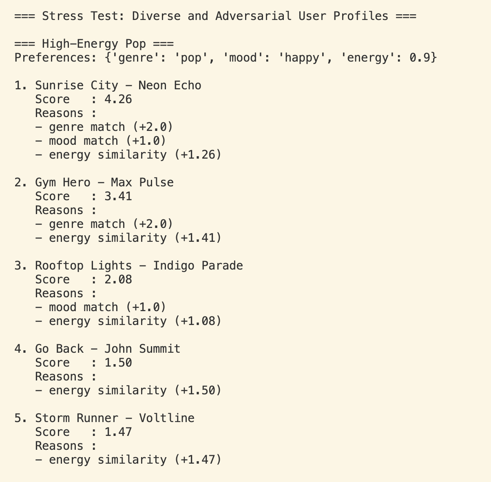
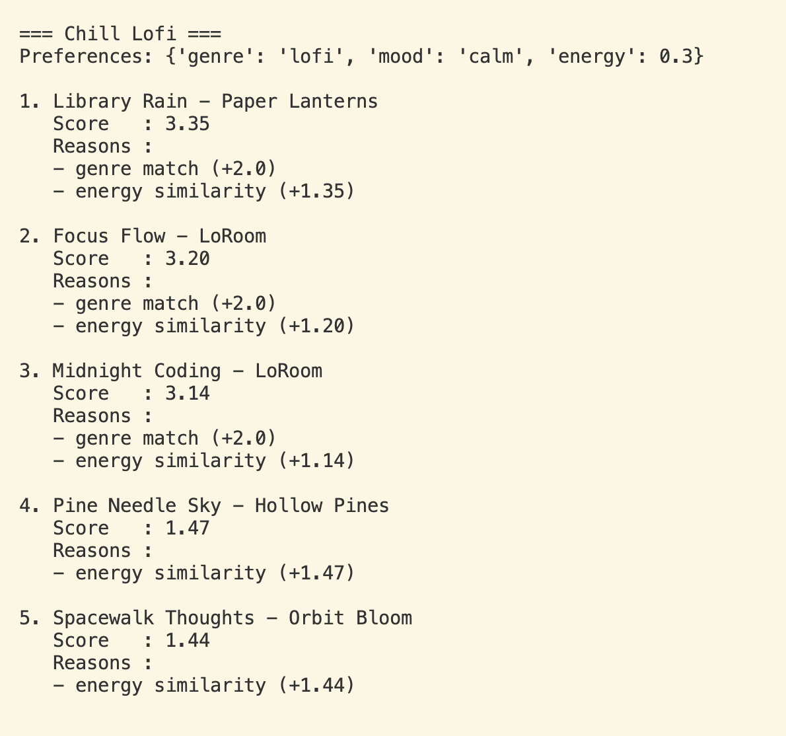
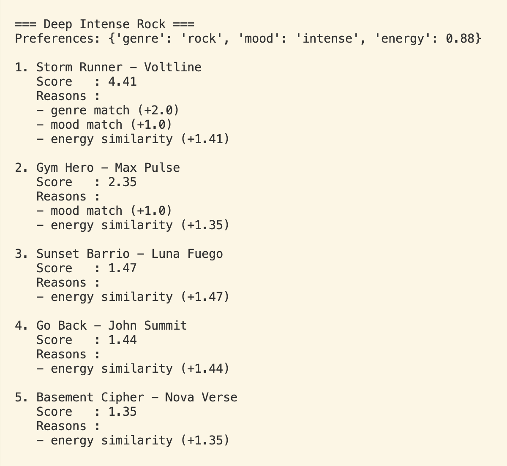
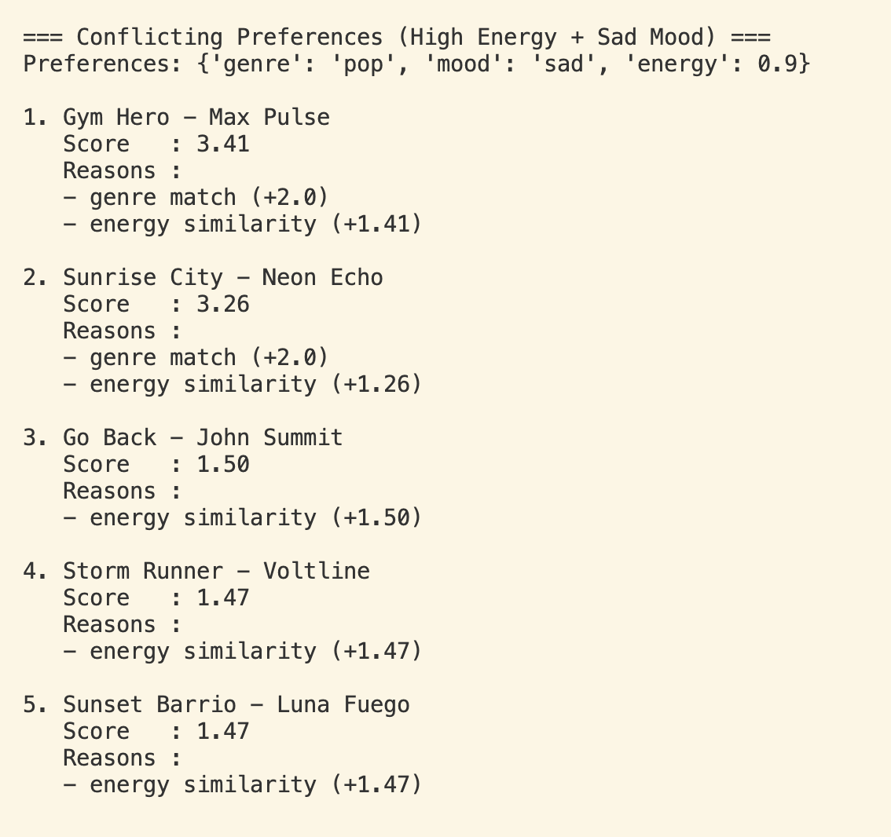
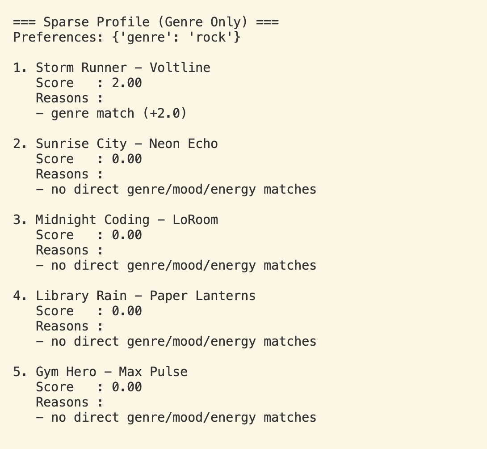
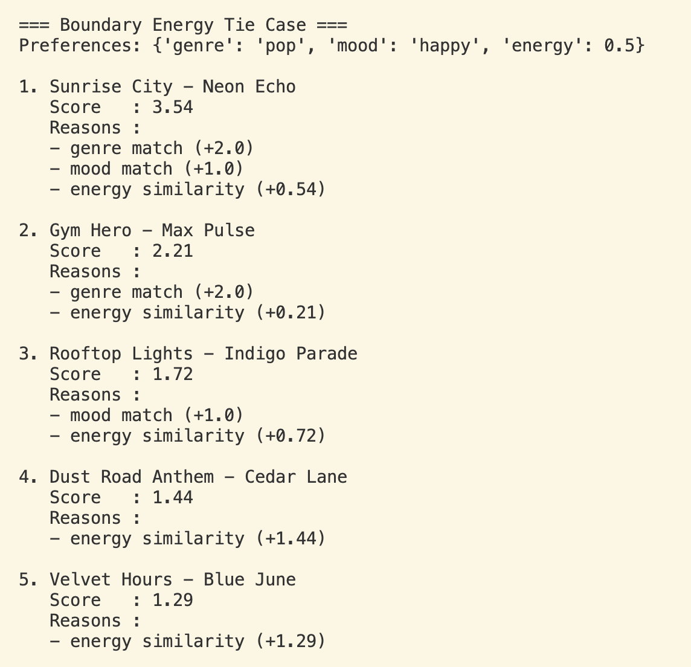
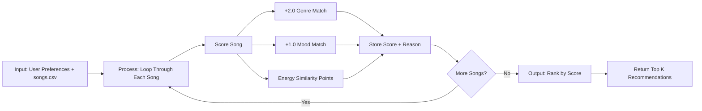
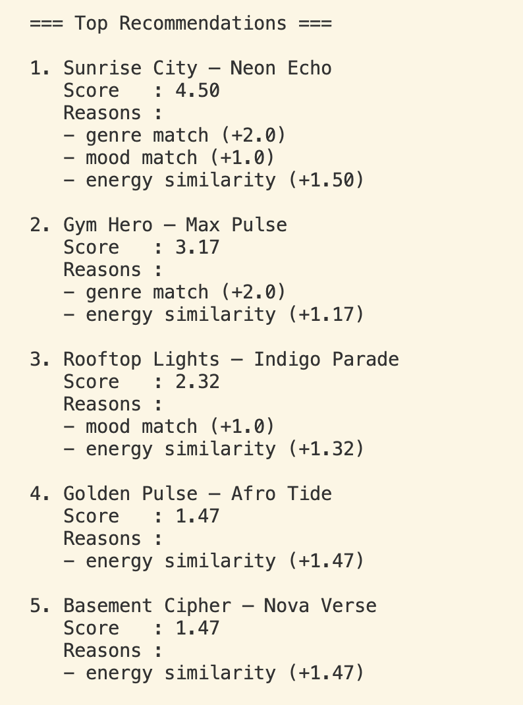

# 🎵 Music Recommender Simulation

## System Evaluation Screenshots (Top-5 Results)

### High-Energy Pop


### Chill Lofi


### Deep Intense Rock


### Conflicting Preferences (High Energy + Sad Mood)


### Sparse Profile (Genre Only)


### Boundary Energy Tie Case


---

## Project Summary

In this project you will build and explain a small music recommender system.

Your goal is to:

- Represent songs and a user "taste profile" as data
- Design a scoring rule that turns that data into recommendations
- Evaluate what your system gets right and wrong
- Reflect on how this mirrors real world AI recommenders

Replace this paragraph with your own summary of what your version does.

---

## How The System Works

Real-world recommendation systems usually combine multiple signals, including patterns from similar users and content-level song attributes, then rank results by predicted satisfaction. This simulator uses a simpler content-based scoring method that compares each song to a user profile and ranks by score. I prioritize genre over mood so the model can discover more songs across broader taste neighborhoods and encourage variety in listening patterns, while mood remains a secondary signal instead of the primary gatekeeper.

Our recommender follows a simple Input -> Process -> Output flow:

- Input: user preferences (`genre`, `mood`, and target `energy`) plus songs loaded from `data/songs.csv`
- Process: loop through every song, score it with the algorithm recipe below, and store score reasons
- Output: sort songs by score and return the top `k` recommendations



Algorithm recipe used for each song:

1. Start score at `0.0`.
2. Add `2.0` points for a genre match.
3. Add `1.0` point for a mood match.
4. Add energy similarity points using:

```text
energy_score = max(0, 1.5 - 3 * abs(song_energy - target_energy))
```

This weighting intentionally makes genre the strongest signal, mood the secondary signal, and energy a tie-breaker style similarity boost.

Potential bias note: this setup may over-prioritize genre and miss cross-genre songs that still match a user's mood or energy very well.

Features used by each `Song`:

- `genre`
- `mood`
- `energy`
- `tempo_bpm`
- `valence`
- `danceability`
- `acousticness`

Features stored in `UserProfile`:

- `favorite_genre`
- `favorite_mood`
- `target_energy`
- `likes_acoustic`

Functional user preference fields (used by `recommend_songs`):

- `genre`
- `mood`
- `energy`
- optional targets: `tempo_bpm`, `valence`, `danceability`, `acousticness`
- optional feature weights with `weight_genre` set higher than `weight_mood`

Recommendation output example:



---

## Getting Started

### Setup

1. Create a virtual environment (optional but recommended):

   ```bash
   python -m venv .venv
   source .venv/bin/activate      # Mac or Linux
   .venv\Scripts\activate         # Windows

2. Install dependencies

```bash
pip install -r requirements.txt
```

3. Run the app:

```bash
python -m src.main
```

### Running Tests

Run the starter tests with:

```bash
pytest
```

You can add more tests in `tests/test_recommender.py`.

---

## Experiments You Tried

Use this section to document the experiments you ran. For example:

- What happened when you changed the weight on genre from 2.0 to 0.5
- What happened when you added tempo or valence to the score
- How did your system behave for different types of users

### System Evaluation: Stress Test with Diverse Profiles

I ran the recommender with six profiles: three baseline profiles and three adversarial edge-case profiles.

Profiles tested:

1. High-Energy Pop: `{"genre": "pop", "mood": "happy", "energy": 0.9}`
2. Chill Lofi: `{"genre": "lofi", "mood": "calm", "energy": 0.3}`
3. Deep Intense Rock: `{"genre": "rock", "mood": "intense", "energy": 0.88}`
4. Conflicting Preferences (High Energy + Sad Mood): `{"genre": "pop", "mood": "sad", "energy": 0.9}`
5. Sparse Profile (Genre Only): `{"genre": "rock"}`
6. Boundary Energy Tie Case: `{"genre": "pop", "mood": "happy", "energy": 0.5}`

Observed patterns:

- Baseline profiles returned intuitive top results with strong genre and mood matches.
- The conflicting profile still surfaced high-energy pop songs, showing energy and genre can dominate mood mismatches.
- The sparse profile produced many tied zero-score songs after the top genre match, showing limited personalization when keys are missing.
- The boundary energy profile showed narrower energy contributions and more ties compared to high-energy profiles.

Terminal screenshot evidence:

#### High-Energy Pop


#### Chill Lofi


#### Deep Intense Rock


#### Conflicting Preferences (High Energy + Sad Mood)


#### Sparse Profile (Genre Only)


#### Boundary Energy Tie Case


---

## Limitations and Risks

Summarize some limitations of your recommender.

Examples:

- It only works on a tiny catalog
- It does not understand lyrics or language
- It might over favor one genre or mood

You will go deeper on this in your model card.

---

## Reflection

Read and complete `model_card.md`:

[**Model Card**](model_card.md)

Write 1 to 2 paragraphs here about what you learned:

- about how recommenders turn data into predictions
- about where bias or unfairness could show up in systems like this


---

## 7. `model_card_template.md`

Combines reflection and model card framing from the Module 3 guidance. :contentReference[oaicite:2]{index=2}  

```markdown
# 🎧 Model Card - Music Recommender Simulation

## 1. Model Name

Give your recommender a name, for example:

> VibeFinder 1.0

---

## 2. Intended Use

- What is this system trying to do
- Who is it for

Example:

> This model suggests 3 to 5 songs from a small catalog based on a user's preferred genre, mood, and energy level. It is for classroom exploration only, not for real users.

---

## 3. How It Works (Short Explanation)

Describe your scoring logic in plain language.

- What features of each song does it consider
- What information about the user does it use
- How does it turn those into a number

Try to avoid code in this section, treat it like an explanation to a non programmer.

---

## 4. Data

Describe your dataset.

- How many songs are in `data/songs.csv`
- Did you add or remove any songs
- What kinds of genres or moods are represented
- Whose taste does this data mostly reflect

---

## 5. Strengths

Where does your recommender work well

You can think about:
- Situations where the top results "felt right"
- Particular user profiles it served well
- Simplicity or transparency benefits

---

## 6. Limitations and Bias

Where does your recommender struggle

Some prompts:
- Does it ignore some genres or moods
- Does it treat all users as if they have the same taste shape
- Is it biased toward high energy or one genre by default
- How could this be unfair if used in a real product

---

## 7. Evaluation

How did you check your system

Examples:
- You tried multiple user profiles and wrote down whether the results matched your expectations
- You compared your simulation to what a real app like Spotify or YouTube tends to recommend
- You wrote tests for your scoring logic

You do not need a numeric metric, but if you used one, explain what it measures.

---

## 8. Future Work

If you had more time, how would you improve this recommender

Examples:

- Add support for multiple users and "group vibe" recommendations
- Balance diversity of songs instead of always picking the closest match
- Use more features, like tempo ranges or lyric themes

---

## 9. Personal Reflection

A few sentences about what you learned:

- What surprised you about how your system behaved
- How did building this change how you think about real music recommenders
- Where do you think human judgment still matters, even if the model seems "smart"

